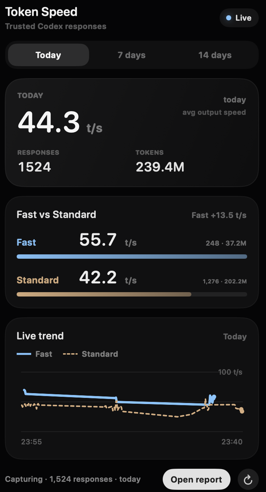

# Codex Speed Monitor

A small macOS menu-bar app for seeing how fast Codex is responding.

It tracks your local Codex responses, shows output tokens per second, and separates Fast vs Standard mode so you can see whether speed settings are actually changing your experience.



## What you get

- Live menu-bar dashboard.
- Today, 7-day, and 14-day views.
- Fast vs Standard speed comparison.
- Model, reasoning level, token, and response counts.
- CSV export from the full report window.
- Local-only storage.

This is an unofficial local tool. It does not patch Codex and it does not send your data anywhere.

## Requirements

- macOS 14 or newer.
- Codex installed and signed in.
- Xcode Command Line Tools.

If you do not have the command line tools yet:

```bash
xcode-select --install
```

## Install

```bash
git clone https://github.com/petergpt/codex-speed-monitor.git
cd codex-speed-monitor
./scripts/install.sh
```

The installer starts the background collector, builds the menu-bar app, and opens it.

After installing, restart Codex if it was already open, then send one Codex message. The app will start filling in from new responses.

## Open the app

The app lives in your menu bar, not the Dock.

To reopen it:

```bash
open ~/Applications/CodexSpeedMonitor.app
```

## Check that it is working

```bash
./scripts/doctor.sh
```

Or:

```bash
~/Library/Application\ Support/CodexSpeedMonitor/bin/codex_telemetry_status.py
```

## Uninstall

```bash
./scripts/uninstall.sh
```

This keeps your local data. To remove the database and logs too:

```bash
./scripts/uninstall.sh --purge
```

## Privacy

Everything is stored locally in:

```text
~/Library/Application Support/CodexSpeedMonitor
```

The local database can contain model names, token counts, response IDs, timing metadata, and selected raw telemetry needed for auditability. Do not publish your database or logs.

## Notes

Fast mode is measured from observed model response output speed. The app excludes obvious non-text or tool-heavy responses from speed charts so image generation, search, and long-running shell commands do not distort tokens/sec.

The project depends on Codex's current local log/state format. If Codex changes those internals, the collector may need an update.

## Developer checks

```bash
python3 tests/test_pipeline.py
python3 tests/audit_pipeline.py
./scripts/build_app.sh
```

## License

MIT
